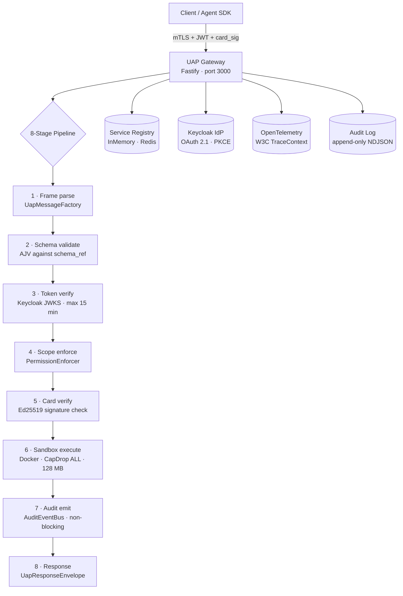

<div align="center">
  
</div>

<br>

```
 ██╗   ██╗ █████╗ ██████╗
 ██║   ██║██╔══██╗██╔══██╗
 ██║   ██║███████║██████╔╝
 ██║   ██║██╔══██║██╔═══╝
 ╚██████╔╝██║  ██║██║
  ╚═════╝ ╚═╝  ╚═╝╚═╝

Universal Agent Protocol
```

**A unified, security-first wire protocol for tool access, agent coordination, and structured RPC.**
Built to close CVE-2025-49596 and the class of tool-poisoning and sandbox-escape vulnerabilities that MCP left structurally open.

[](https://opensource.org/licenses/Apache-2.0)
[](https://www.typescriptlang.org/)
[](https://nodejs.org/)
[](https://www.python.org/)
[]()

---

## 30-second quickstart

```bash
git clone https://github.com/RajSidwadkar/UAP-protocol
cd UAP-protocol
npm install
npx tsx scripts/generate-keypair.ts
docker compose -f docker-compose.dev.yml up -d
```

```bash
curl http://localhost:3000/health
# {"status":"ok","version":"1.0.0"}
```

That starts Keycloak on `:8080` and the UAP Gateway on `:3000`. The gateway enforces mTLS, verifies Ed25519-signed CapabilityCards, and runs every tool call in an ephemeral Docker container. No configuration required beyond the generated keypair.

---

## Architecture



**Hexagonal layers** — domain has zero I/O dependencies. Every infrastructure concern sits behind a typed port interface. Swap Docker for WASM, Keycloak for Auth0, Pino for a SIEM exporter — zero domain impact.

| Layer | Contents | Dependencies |
|---|---|---|
| Domain | `UapEnvelope`, `CapabilityCard`, `AuditEvent`, `Task` | None — stdlib only |
| Application | `InvokeToolUseCase`, `DelegateTaskUseCase`, `ValidateCardUseCase` | Domain ports only |
| Infrastructure | `KeycloakAuthAdapter`, `DockerSandboxAdapter`, `Ed25519SignerAdapter`, `PinoAuditAdapter` | App ports + external libs |
| Transport | UAP-RPC frame parser, Fastify gateway, SSE/WebSocket handlers | Infrastructure + domain serializers |

---

## UAP vs MCP vs A2A vs JSON-RPC 2.0

| Feature | UAP | MCP | A2A | JSON-RPC 2.0 |
|---|---|---|---|---|
| Mandatory auth | ✅ mTLS + JWT always | ❌ Optional | ⚠️ API key only | ❌ None |
| Tool metadata integrity | ✅ Ed25519-signed payload | ❌ Post-publish mutation possible | ❌ No signing | ❌ No signing |
| Sandbox model | ✅ Per-call ephemeral Docker | ⚠️ Server-level only | ❌ None | ❌ None |
| Agent discovery | ✅ Hub-and-spoke · N connections | ❌ N² direct HTTP | ⚠️ DNS-based | ❌ None |
| Audit trail | ✅ Protocol-native append-only log | ❌ None | ❌ None | ❌ None |
| Distributed tracing | ✅ W3C TraceContext mandatory | ❌ None | ❌ None | ❌ None |
| Schema validation | ✅ AJV at transport layer | ⚠️ Optional Zod | ❌ None | ❌ None |
| Token lifetime cap | ✅ 15-min enforced | ❌ Unenforced | ❌ Unenforced | ❌ N/A |
| Batch semantics | ✅ serial · parallel · transactional | ❌ Undefined | ❌ None | ⚠️ Ambiguous |
| Binary payloads | ✅ Native frames | ❌ Base64 only | ❌ Base64 only | ❌ Base64 only |
| IdP model | ✅ External IdP only | ❌ Server is its own OAuth provider | ⚠️ Varies | ❌ None |
| Bridge adapters | ✅ MCP + A2A bridges ship in Phase 2 | ❌ No bridge | ❌ No bridge | ❌ No bridge |
| Horizontal scale | ✅ Stateless · any load balancer | ❌ Sticky sessions | ⚠️ Varies | ❌ None |

---

## Why UAP exists

- **CVE-2025-49596 (tool-poisoning via unsigned metadata).** MCP tool descriptions are mutable after publication. An attacker can inject malicious instructions into tool names or descriptions post-deployment — the client has no way to detect tampering. UAP puts all tool metadata inside the Ed25519-signed `CapabilityCard` payload. Any mutation after signing invalidates the signature and the gateway rejects the card before executing anything.

- **CWE-284 / sandbox-escape class.** MCP runs tools at the server process level. A path traversal or process injection in any tool reaches the host filesystem and network. UAP creates a fresh Docker container per call — read-only rootfs, `CapDrop: ALL`, 128 MB RAM cap, network disabled by default. The container is destroyed after the response. There is no persistent attack surface between calls.

- **CWE-287 / confused-deputy auth.** MCP acts as its own OAuth provider, making it both the resource server and the authorization server. This is the classic confused-deputy pattern. UAP separates these roles: the gateway is a pure resource server. Keycloak (or any external IdP) is the sole authority. JWTs are verified against a remote JWKS endpoint and hard-capped at 15 minutes.

---

## Wire format

Every UAP message uses the same envelope. The `auth` block carries a scoped JWT and a reference to the agent's signed CapabilityCard. The gateway verifies both before the request reaches any application code.

```json
{
  "uap": {
    "version": "1.0",
    "type": "tool_call",
    "id": "01ARZ3NDEKTSV4RRFFQ69G5FAV",
    "trace": {
      "traceparent": "00-4bf92f3577b34da6a3ce929d0e0e4736-00f067aa0ba902b7-01"
    },
    "auth": {
      "token": "eyJhbGciOiJSUzI1NiJ9...",
      "scope": ["tool:read"],
      "card_sig": "ed25519:a1b2c3d4..."
    }
  },
  "method": "tools/invoke",
  "schema_ref": "uap:tool.invoke/v1",
  "params": {
    "tool_id": "db:query",
    "input": { "sql": "SELECT 1" }
  },
  "ack": true
}
```

---

## Packages

```
UAP-protocol/
├── packages/
│   ├── gateway/      @uap/gateway   — Fastify-based UAP Gateway
│   ├── sdk-ts/       @uap/sdk-ts    — TypeScript client + server SDK
│   └── sdk-py/       uap-sdk        — Python async SDK (httpx + FastAPI)
├── scripts/
│   ├── generate-keypair.ts          — Ed25519 keypair for local dev
│   └── keycloak-bootstrap.ts        — Idempotent Keycloak realm setup
└── docker/
    └── sandbox/                     — Base image for zero-trust tool execution
```

---

## TypeScript client

```typescript
import { UapClient, ClientCredentialsTokenProvider } from "@uap/sdk-ts";

const client = new UapClient({
  gatewayUrl: "https://gateway.example.com",
  tokenProvider: new ClientCredentialsTokenProvider({
    tokenUrl: process.env.TOKEN_URL!,
    clientId: process.env.CLIENT_ID!,
    clientSecret: process.env.CLIENT_SECRET!,
  }),
});

const result = await client.invokeTool(
  "db:query",
  { sql: "SELECT * FROM users LIMIT 10" },
  ["tool:read"]
);

const task = await client.delegateTask(
  "summarizer",
  { text: "..." },
  ["task:submit"]
);
```

---

## Python client

```python
from uap_sdk.client import UapClient, UapClientOptions
from uap_sdk.token import ClientCredentialsTokenProvider

async with UapClient(UapClientOptions(
    gateway_url="https://gateway.example.com",
    token_provider=ClientCredentialsTokenProvider(
        token_url=os.environ["TOKEN_URL"],
        client_id=os.environ["CLIENT_ID"],
        client_secret=os.environ["CLIENT_SECRET"],
    )
)) as client:
    result = await client.invoke_tool("db:query", {"sql": "SELECT 1"}, ["tool:read"])
```

**FastAPI middleware**

```python
from uap_sdk.middleware import uap_auth

@app.post("/summarize")
@uap_auth(scope=["task:submit"])
async def summarize(request: Request):
    claims = request.state.uap_claims  # typed AuthClaims
    ...
```

---

## Migrate an existing MCP server

The `uap-migrate` CLI wraps any MCP server as a signed UAP CapabilityCard in under 5 minutes. Idempotent — re-running on an already-migrated server is a no-op.

```bash
node dist/cli/migrate.js mcp http://localhost:3001 \
  --issuer did:uap:my-org \
  --key config/dev.privkey.hex \
  --out ./uap-cards

# → ./uap-cards/did:uap:my-org.card.json
```

---

## CapabilityCard signing

Tool names, descriptions, and parameter schemas are part of the Ed25519-signed payload. Mutating any field after signing invalidates the signature — structurally defeating tool-poisoning.

```typescript
const signed = await signer.sign({
  issuer: "did:uap:my-agent",
  version: "1.0.0",
  tools: [{
    id: "db:query",
    description: "Run a read-only SQL query",
    inputSchema: { type: "object", required: ["sql"] },
    scopes: ["tool:read"]
  }],
  scopes: ["tool:read"],
  issuedAt: Date.now(),
  expiresAt: Date.now() + 86_400_000 * 30
});
// signed.signature === "ed25519:a1b2c3..."
```

---

## Environment variables

| Variable | Description | Default |
|---|---|---|
| `KEYCLOAK_URL` | Keycloak base URL | `http://localhost:8080` |
| `KEYCLOAK_REALM` | Realm name | `uap` |
| `UAP_AUDIENCE` | JWT audience claim | `uap-gateway` |
| `UAP_SIGNING_KEY_PATH` | Path to Ed25519 private key hex | `config/dev.privkey.hex` |
| `UAP_DOCKER_SOCKET` | Docker socket path | `/var/run/docker.sock` |
| `UAP_AUDIT_LOG_DIR` | Append-only audit NDJSON log directory | `/var/log/uap` |
| `UAP_GATEWAY_PORT` | Gateway listen port | `3000` |
| `UAP_MTLS_CERT` | Server TLS certificate (PEM) | `certs/server.crt` |
| `UAP_MTLS_KEY` | Server TLS private key (PEM) | `certs/server.key` |
| `UAP_MTLS_CA` | CA cert for client cert verification | `certs/ca.crt` |
| `OTEL_EXPORTER_OTLP_ENDPOINT` | OpenTelemetry collector endpoint | `http://localhost:4318` |
| `REDIS_URL` | Redis for multi-instance registry (optional) | — |

---

## Core dependencies

| Package | Version | Purpose |
|---|---|---|
| `fastify` | `^4.27` | Gateway HTTP server |
| `zod` | `^3.23` | Envelope schema and type inference |
| `@noble/curves` | `^1.4` | Ed25519 signing |
| `jose` | `^5.4` | JWT verification, JWKS client |
| `ajv` | `^8.16` | Transport-level param validation |
| `dockerode` | `^4.0` | Zero-trust sandbox adapter |
| `pino` | `^9.2` | Append-only structured audit log |
| `ulid` | `^2.3` | Sortable unique IDs |
| `@opentelemetry/sdk-node` | `^0.52` | Distributed tracing |
| `ioredis` | `^5.3` | Multi-instance service registry |
| `@modelcontextprotocol/sdk` | `^1.0` | MCP bridge adapter |
| `httpx` (Python) | `^0.27` | Async HTTP client for Python SDK |
| `pydantic` (Python) | `^2.7` | Python type validation |

---

## Contributing

Branch naming: `feat/<sprint>-<task>-<slug>` — e.g. `feat/s2-2.1-mtls-keycloak`

Every change follows: branch → `npx tsc --noEmit` + `npx vitest run` locally → commit → PR → squash merge → branch delete. No CI dependency for local development.

```bash
# Run all tests before committing
cd packages/gateway && npx vitest run
cd packages/sdk-ts  && npx vitest run
cd packages/sdk-py  && python -m pytest tests/ -v
```

**Roadmap:** Sprint 0 (scaffold) → Sprint 1 (schema + signing + RPC) → Sprint 2 (security core) → Sprint 3 (gateway + registry) → Sprint 4 (bridge adapters) → Sprint 5 (SDKs + Docker image). 
---

<div align="right">
  
</div>

*UAP · Universal Agent Protocol · 2026*

SPDX-License-Identifier: Apache-2.0
